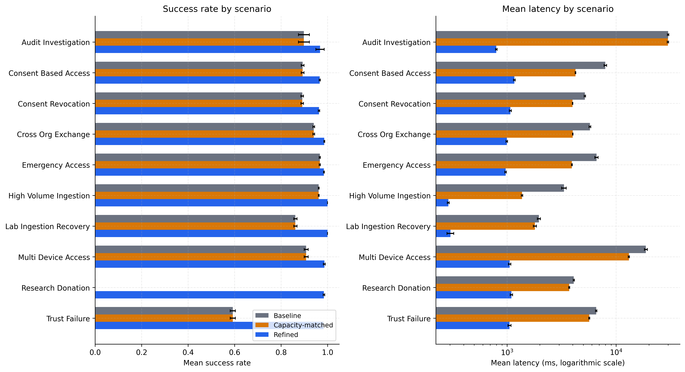
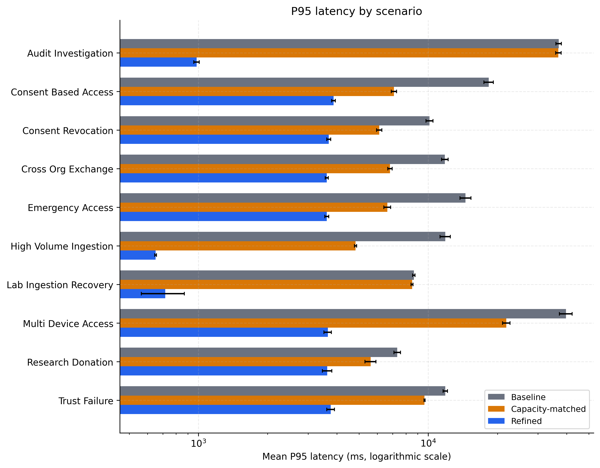
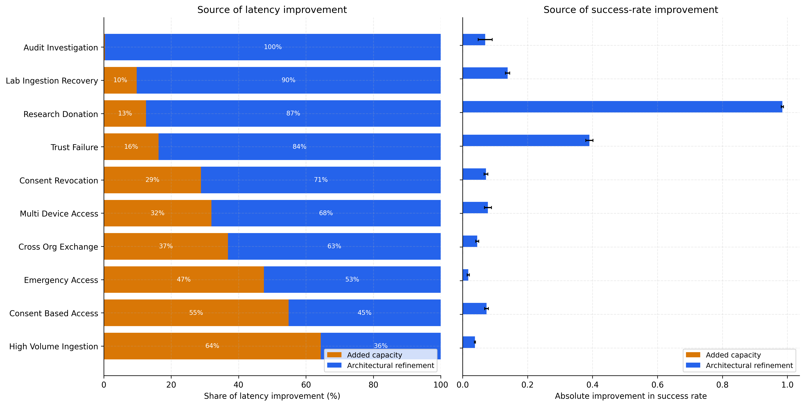
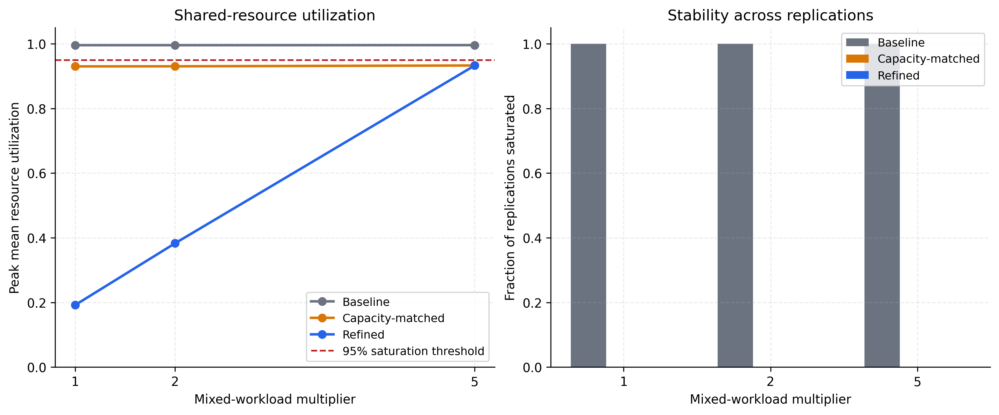
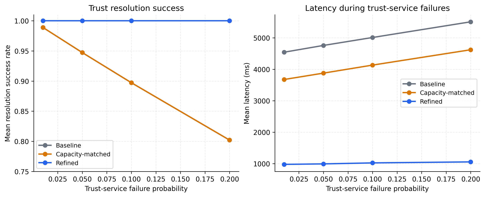
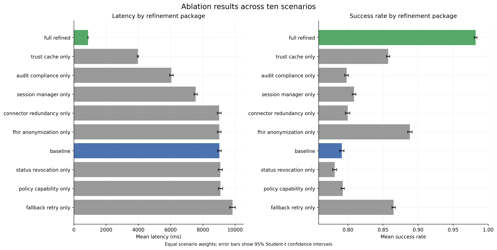

# Simulation results

## Evidence scope

This document summarizes the publication-scale results from the completed discrete-event simulation.

The results use:

- 30 replications;
- a 3,600-second simulation horizon;
- a 300-second warm-up;
- a 3,300-second measurement window; and
- common random numbers for architecture comparison.

The results compare:

- **Baseline:** original architecture behaviour and capacities.
- **Capacity-matched:** baseline behaviour with refined capacities.
- **Refined:** refined capabilities and capacities.

These are simulation results under the committed configuration. They are not measurements from a deployed healthcare system.

## Architecture comparison

| Scenario | Baseline success | Capacity-matched success | Refined success | Baseline latency (ms) | Capacity-matched latency (ms) | Refined latency (ms) |
|---|---:|---:|---:|---:|---:|---:|
| Audit investigation | 89.83% | 89.83% | 96.78% | 30,018.4 | 29,925.4 | 798.0 |
| Consent-based access | 89.28% | 89.28% | 96.64% | 7,968.0 | 4,238.9 | 1,167.2 |
| Consent revocation | 89.09% | 89.09% | 96.30% | 5,172.8 | 3,989.9 | 1,073.1 |
| Cross-organisational exchange | 94.08% | 94.08% | 98.59% | 5,762.6 | 4,007.2 | 995.7 |
| Emergency access | 96.68% | 96.68% | 98.44% | 6,610.4 | 3,931.8 | 970.8 |
| High-volume ingestion | 96.19% | 96.19% | 100.00% | 3,329.0 | 1,372.5 | 289.7 |
| Laboratory-ingestion recovery | 86.15% | 86.15% | 100.00% | 1,964.2 | 1,802.0 | 302.9 |
| Multi-device access | 90.81% | 90.81% | 98.61% | 18,754.5 | 13,105.3 | 1,059.1 |
| Research donation | 0.00% | 0.00% | 98.44% | 4,092.8 | 3,716.8 | 1,098.0 |
| Trust failure | 59.22% | 59.22% | 98.27% | 6,565.1 | 5,669.9 | 1,053.1 |

The refined configuration reduces mean latency and improves success in every main scenario comparison.

The mean-latency reduction ranges from 73.2% for research donation to 97.3% for audit investigation.

The research-donation baseline has zero success because the required modeled anonymization capability is unavailable.

## Tail latency

P95 latency represents the slower requests and shows whether an improvement is limited to the average.

| Scenario | Baseline P95 (ms) | Capacity-matched P95 (ms) | Refined P95 (ms) | Baseline-to-refined reduction |
|---|---:|---:|---:|---:|
| Audit investigation | 36,950.3 | 36,824.9 | 982.0 | 97.34% |
| Consent-based access | 18,329.6 | 7,099.0 | 3,871.1 | 78.88% |
| Consent revocation | 10,127.1 | 6,122.2 | 3,693.3 | 63.53% |
| Cross-organisational exchange | 11,817.0 | 6,815.2 | 3,617.8 | 69.38% |
| Emergency access | 14,537.7 | 6,635.6 | 3,618.2 | 75.11% |
| High-volume ingestion | 11,860.5 | 4,823.4 | 651.3 | 94.51% |
| Laboratory-ingestion recovery | 8,657.9 | 8,506.0 | 717.1 | 91.72% |
| Multi-device access | 39,749.5 | 21,870.3 | 3,655.5 | 90.80% |
| Research donation | 7,335.4 | 5,616.2 | 3,631.9 | 50.49% |
| Trust failure | 11,872.9 | 9,636.9 | 3,761.0 | 68.32% |

The refined configuration lowers P95 latency in all ten scenarios.

## Capacity versus architectural behaviour

The capacity-matched control separates improvement caused by additional capacity from improvement caused by architectural behaviour.

| Scenario | Total latency reduction | Share from capacity | Share from architectural behaviour |
|---|---:|---:|---:|
| Audit investigation | 97.3% | 0.3% | 99.7% |
| Consent-based access | 85.4% | 54.8% | 45.2% |
| Consent revocation | 79.3% | 28.9% | 71.1% |
| Cross-organisational exchange | 82.7% | 36.8% | 63.2% |
| Emergency access | 85.3% | 47.5% | 52.5% |
| High-volume ingestion | 91.3% | 64.4% | 35.6% |
| Laboratory-ingestion recovery | 84.6% | 9.8% | 90.2% |
| Multi-device access | 94.4% | 31.9% | 68.1% |
| Research donation | 73.2% | 12.6% | 87.4% |
| Trust failure | 84.0% | 16.2% | 83.8% |

Capacity contributes substantially in consent-based access and high-volume ingestion.

Architectural behaviour accounts for most of the modeled latency improvement in eight of the ten scenarios.

Capacity does not improve success in this experiment because the capacity-matched configuration retains the baseline capabilities and failure behaviour.

## Shared workload and resource saturation

The mixed-workload experiment runs all ten scenarios against shared resources.

Trust resolution is the peak-utilization resource for every evaluated architecture and workload combination.

| Workload | Baseline peak trust utilization | Capacity-matched | Refined |
|---|---:|---:|---:|
| 1x | 99.56% | 93.00% | 19.19% |
| 2x | 99.56% | 93.03% | 38.29% |
| 5x | 99.57% | 93.28% | 93.27% |

The baseline reaches the 95% saturation threshold in every replication at all three workload levels.

The capacity-matched and refined configurations remain below the threshold in the summarized results, although both approach it at 5x workload.

The baseline mixed-workload experiment produces very large waiting times and latencies because the queue grows beyond the simulation horizon.

These values represent an unstable overloaded model condition. They should not be interpreted as ordinary steady-state response times.

## Trust-service failure

The trust-failure experiment increases the probability that trust resolution fails.

| Trust failure probability | Baseline success | Capacity-matched success | Refined success |
|---|---:|---:|---:|
| 1% | 98.87% | 98.87% | 98.39% |
| 5% | 94.72% | 94.72% | 98.43% |
| 10% | 89.72% | 89.72% | 98.36% |
| 20% | 80.21% | 80.21% | 98.27% |

At the lowest trust-failure probability, the refined success rate is slightly lower because it also performs explicit credential-status checking.

As trust failures increase, the refined retry, fallback, caching, and circuit-breaker mechanisms maintain a much higher success rate.

## Credential-status failure and fail-safe rejection

The baseline and capacity-matched configurations do not perform explicit credential-status checking in this experiment.

Their success therefore remains at 96.68% when the configured status-service failure probability changes.

The refined configuration performs status checking for every applicable request.

| Status failure probability | Refined success | Status-check failure rate |
|---|---:|---:|
| 0% | 100.00% | 0.00% |
| 2% | 97.90% | 2.10% |
| 5% | 94.91% | 5.09% |
| 10% | 89.74% | 10.26% |

A lower apparent success rate does not automatically mean worse security.

The refined workflow rejects a request when credential validity cannot be confirmed. This is modeled fail-safe behaviour.

## Trust-cache lifetime trade-off

| Cache TTL | Mean latency (ms) | Observed cache-hit rate | Estimated stale-cache risk |
|---|---:|---:|---:|
| 30 seconds | 1,539.3 | 72.06% | 0.59% |
| 120 seconds | 1,205.9 | 82.68% | 2.70% |
| 300 seconds | 983.8 | 89.79% | 7.16% |
| 900 seconds | 970.8 | 90.26% | 19.91% |
| 3,600 seconds | 970.8 | 90.26% | 56.89% |

Longer cache lifetime reduces latency until the configured cache-hit probability reaches its maximum.

The estimated risk of using stale trust information continues to increase. Therefore, the longest cache lifetime is not automatically the best choice.

## Session-revalidation trade-off

For one modeled revocation per hour:

| Revalidation interval | Expected checks per session-hour | Mean unauthorized continuation |
|---|---:|---:|
| 5 seconds | 720 | 2.49 seconds |
| 30 seconds | 120 | 14.78 seconds |
| 60 seconds | 60 | 29.53 seconds |
| 300 seconds | 12 | 147.52 seconds |

Shorter intervals reduce the time that revoked access may remain active, but they require more frequent checking.

This is a security and performance trade-off. The simulation does not identify one universally optimal interval.

## Ablation results

The ablation experiment compares the baseline, individual refinement packages, and the complete refined configuration across all ten scenarios.

| Variant | Mean success | Mean latency (ms) |
|---|---:|---:|
| Baseline | 79.13% | 9,023.8 |
| Trust cache only | 85.75% | 3,974.7 |
| Audit and compliance only | 79.81% | 6,051.8 |
| Session manager only | 80.88% | 7,553.6 |
| Fallback and retry only | 86.52% | 9,835.3 |
| FHIR and anonymization only | 88.84% | 9,014.0 |
| Full refined | 98.21% | 880.8 |

Trust caching provides the largest individual latency reduction among the tested packages, but it does not reproduce the complete refined result.

Some packages improve capability or failure behaviour without reducing overall latency.

No individual refinement package produces the complete outcome. Several mechanisms must work together.

## Connector interpretation

The connector does not become the principal performance bottleneck under the tested workloads.

Increasing connector capacity therefore produces less performance improvement than trust-related changes.

Connector redundancy remains architecturally important for failover, even when the connector does not dominate latency.

## Governance-capability indicators

The refined workflows exercise obligation handling, data minimization, compliance recording, structured audit tagging, and anonymization where those capabilities apply.

These values show that a modeled workflow invoked a capability.

They do not prove:

- legal compliance;
- semantic completeness of audit records;
- anonymization correctness; or
- correct governance implementation in a deployed system.

## Main conclusions

1. Additional capacity reduces latency but cannot supply missing architectural capabilities.
2. The refined configuration improves mean latency, P95 latency, and success across the ten main scenario comparisons.
3. Trust resolution is the main shared-resource bottleneck in the mixed workload.
4. Retry, fallback, caching, and circuit breaking improve resilience to trust-service failure.
5. Security mechanisms introduce measurable trade-offs.
6. No individual ablation package reproduces the complete refined result.

## Limitations

The results provide model-level evidence under controlled assumptions.

The simulation does not prove:

- production performance or scalability;
- real hospital availability;
- legal or regulatory compliance;
- clinical safety;
- complete semantic FHIR conformance;
- anonymization correctness; or
- patient identity-matching correctness.

Service-time distributions, workload rates, capacities, and failure probabilities are modelling assumptions.

Confidence intervals quantify variability across replications. They do not quantify uncertainty in the assumptions or model structure.

Very large mixed-workload latency indicates unstable queue growth. It should not be reported as an ordinary steady-state latency estimate.

## Reproduction

From the repository root:

```bash
python run_advanced_experiments.py \
  --config config_publication_scale.json \
  --output-directory publication_results

python analyze_results.py \
  --results-directory publication_results

python plot_advanced_results.py \
  --results-directory publication_results \
  --figures-directory publication_figures

python verify_simulation.py

## Selected publication figures

### Architecture and scenario comparison



### P95 latency comparison



### Capacity attribution



### Mixed-workload stability



### Trust-failure sensitivity



### Ablation comparison


